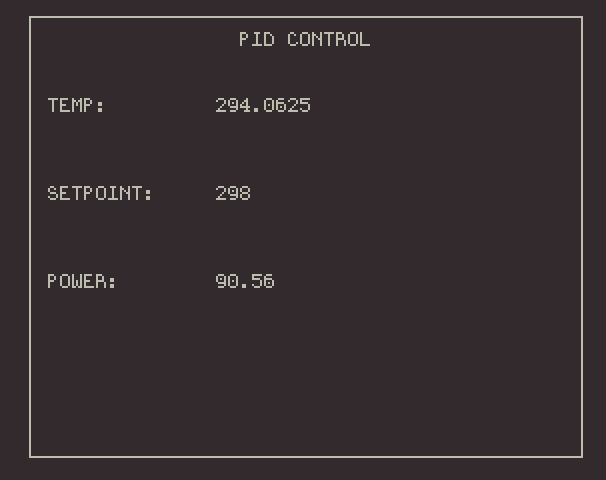

# CPID

### C++ based serial interfacing with Arduino for PID control

---

<p align="center">

</p>

CPID is a C++ program that controls and reads data from an Arduino through a serial connection and a simple ncurses interface.
The native analog to digital resolution of the Arduino is improved to 15 bits using an ADS1115 
4 channel 16 bit analog to digital converter. PID constants are defined in ```PID.ino```. The setpoint can 
be changed by keying ```s``` with the interface open.

The ADS1115 uses SDA/SCL to communicate with the Arduino. This particular instance uses pins 8 and 3 to
control the respective direction (DIR) and PWM (PWMH) signals for a VNH5019 motor driver carrier.

## Installation

Unpack contents and type ```make```. Use the Arduino software to upload PID.ino to the board over USB.

## Dependencies

- <ncurses.h>
- <Adafruit_ADS1015.h>


